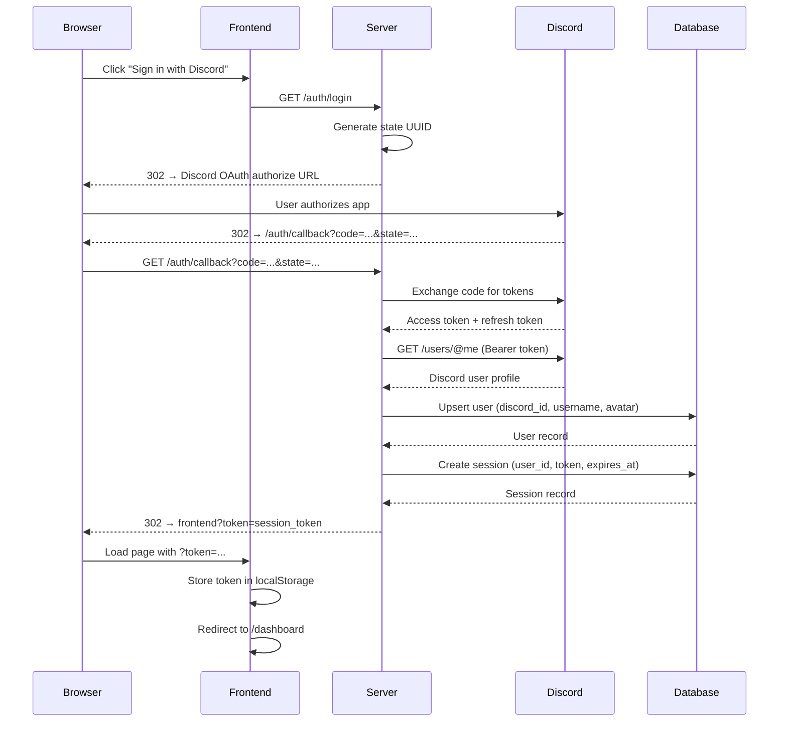
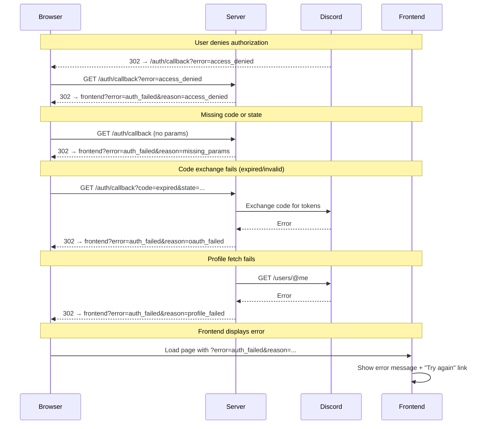
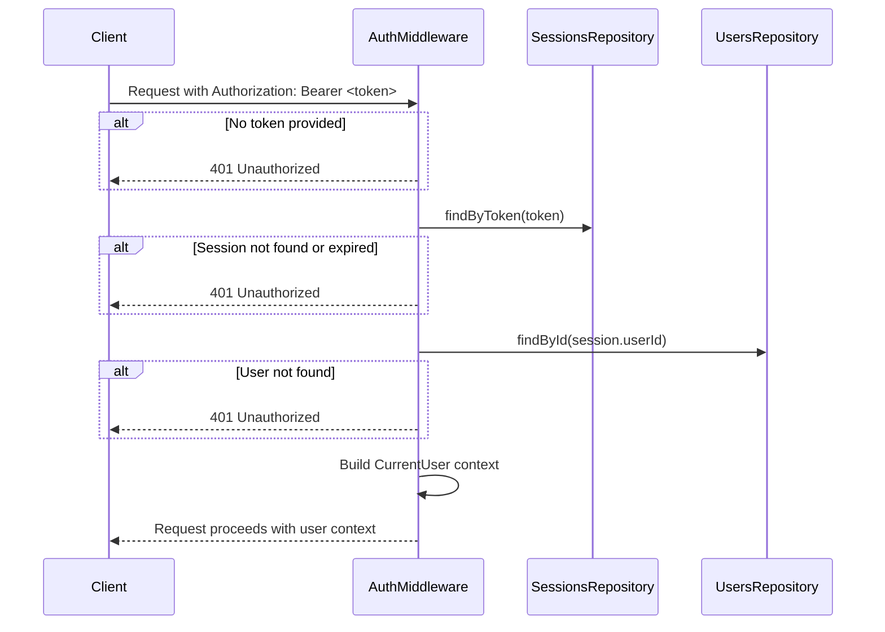

# Auth Flow

## Happy-Path Login

```mermaid
sequenceDiagram
    participant B as Browser
    participant F as Frontend
    participant S as Server
    participant D as Discord
    participant DB as Database

    B->>F: Click "Sign in with Discord"
    F->>S: GET /auth/login
    S->>S: Generate state UUID
    S-->>B: 302 → Discord OAuth authorize URL

    B->>D: User authorizes app
    D-->>B: 302 → /auth/callback?code=...&state=...

    B->>S: GET /auth/callback?code=...&state=...
    S->>D: Exchange code for tokens
    D-->>S: Access token + refresh token
    S->>D: GET /users/@me (Bearer token)
    D-->>S: Discord user profile
    S->>DB: Upsert user (discord_id, username, avatar)
    DB-->>S: User record
    S->>DB: Create session (user_id, token, expires_at)
    DB-->>S: Session record
    S-->>B: 302 → frontend?token=session_token

    B->>F: Load page with ?token=...
    F->>F: Store token in localStorage
    F->>F: Redirect to /dashboard
```

## Error Paths

```mermaid
sequenceDiagram
    participant B as Browser
    participant S as Server
    participant D as Discord
    participant F as Frontend

    Note over B,F: User denies authorization
    D-->>B: 302 → /auth/callback?error=access_denied
    B->>S: GET /auth/callback?error=access_denied
    S-->>B: 302 → frontend?error=auth_failed&reason=access_denied

    Note over B,F: Missing code or state
    B->>S: GET /auth/callback (no params)
    S-->>B: 302 → frontend?error=auth_failed&reason=missing_params

    Note over B,F: Code exchange fails (expired/invalid)
    B->>S: GET /auth/callback?code=expired&state=...
    S->>D: Exchange code for tokens
    D-->>S: Error
    S-->>B: 302 → frontend?error=auth_failed&reason=oauth_failed

    Note over B,F: Profile fetch fails
    S->>D: GET /users/@me
    D-->>S: Error
    S-->>B: 302 → frontend?error=auth_failed&reason=profile_failed

    Note over B,F: Frontend displays error
    B->>F: Load page with ?error=auth_failed&reason=...
    F->>F: Show error message + "Try again" link
```

## Session Validation (Auth Middleware)

```mermaid
sequenceDiagram
    participant C as Client
    participant M as AuthMiddleware
    participant SR as SessionsRepository
    participant UR as UsersRepository

    C->>M: Request with Authorization: Bearer <token>

    alt No token provided
        M-->>C: 401 Unauthorized
    end

    M->>SR: findByToken(token)

    alt Session not found or expired
        M-->>C: 401 Unauthorized
    end

    M->>UR: findById(session.userId)

    alt User not found
        M-->>C: 401 Unauthorized
    end

    M->>M: Build CurrentUser context
    M-->>C: Request proceeds with user context
```
